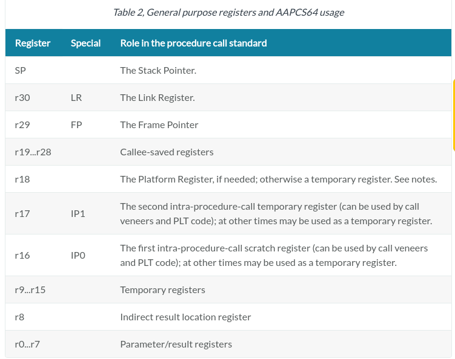

# Custom-Arm-OS

## Scheduling 

### Task (struct)
- state of task
- counter
- priority
- halted
- cpu\_context
  - Replace register (done in asm)
    - Save 19\-\-28 as callee-saved registers, LR, FP,SP,PC as special registers. 
    - [Documentation](https://developer.arm.com/documentation/ihi0055/d/)

### Scheduling implementation
- Create 3 tables with specific size (could be done with list but has to create malloc). Create pointers : head, curr,tail and a counter = size.
  - Head : to know the starting position of the table
  - Curr : the next to be taken by scheduler
  - Tail : the last , if someone comes goes here. 

### Priorities 
  - High Priority   (non-preemptive scheduling: stop everything and run this)
  - Middle Priotity (preemptive scheduling: when a process is finished)
  - Low Priotity    (preemptive)

### Console Commands 
- Forking|Creating tasks : fork(name,priority)
- Scheduler Demo

### Task timing
- High Priority   : 1   sec
- Middle Priority : 5   sec
- Low Priority    : 10  sec

### Print tasks
Every time a task is added, finished, interrupted|context\_switching print all tasks in beautifull ways.

### Demo
Create some processes of diffenent priorities (Middle-Low)
Suddenly a high priority comes. 
Current process must stop. High priority must be executed.
When high priority process finished, and if there are no more, then last priority should continue.

### Things to try 
- Changing priorities(if a low priority halts enough time changes priority)

