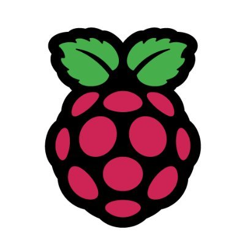

# Custom operating system for Armv8-A



    

     


Simple ARM Operating System for the Raspberry Pi, supporting Aarch64 architecture. The board supported is Raspberry Pi 3 A+.

This project was made for the Embedded Systems course at NTUA 2021-2022.

## Table of content
1. [How to start](#introduction)

## How to start <a name="introduction"></a>
- [Cross-Compiler-for-Arm](https://developer.arm.com/-/media/Files/downloads/gnu-a/10.3-2021.07/binrel/gcc-arm-10.3-2021.07-x86_64-aarch64-none-elf.tar.xz)
    - For all compilers : [Here](https://developer.arm.com/tools-and-software/open-source-software/developer-tools/gnu-toolchain/gnu-a/downloads)
- Install screen program.
- Set up Sd card with 2 partitions. We suggest you do use that by installing Rasberry Os : [here](https://www.raspberrypi.com/software/)
- Replace confix.txt in /boot partition 
- Change ARMGMU flag in Makefile according to your crosscompiler. 
```
make 
```
- Replace the kernel8.img in /boot partition with the one produced by make.
- Connect rasberry pi with TTL cable to one of your usb with connecting the pins in this [order](https://cdn-learn.adafruit.com/downloads/pdf/adafruits-raspberry-pi-lesson-5-using-a-console-cable.pdf) . 
- Open screen with `sudo screen /dev/ttyUSB0 115200`
- Power Rasberry pi 

## Demo 
We created a video with a demo , so you can see the results of this kernel. 
The demo can be found in this google drive [link](https://drive.google.com/drive/folders/19DO5QxhzmMUzHWNDTsFCbGuKfKurns4N)

To understand the scheduler demo : 
- We created 4 tasks : 
    - task("12345",L)
    - task("zqrty",H)
    - task("abcde",M)
    - task("rtyui",M)
- L task starts its excecution
- When H task starts, scheduler wait for this to be finished ( Non-Preemptive).
- In the mean time the 2 M tasks have come, and when H task finished they start to be excecuted cicrularly.
- Because the Low task has not been scheduled for a long time, it changes its prioriry to Middle. 

## Technology used
- Board : Rasberry Pi 3 A+
    - Peripherals module : [BCM2837-Broadcom](https://github.com/raspberrypi/documentation/files/1888662/BCM2837-ARM-Peripherals.-.Revised.-.V2-1.pdf)
    - Architecture : Armv8-A
    - Cpu : [Contex-A53](https://developer.arm.com/Processors/Cortex-A53#Technical-Specifications)
- Arduino Nano 
- Cables 
    - TTL to Usb
    - Usb power cables
- SD card


## Functionalities 

### Peripherals 

#### Uart 1

We are using "miniUART" or "UART1" , because UART0(PL011) is connected to bluetooth and we want to keep this functionality open for development. 

- First we have to set GPIO pins 14,15 to their function TXD1 and RXD1 respectively.

- Then we disable flow control and interrupts just to make it easier to test. Also, baud rate is set to 115200 and the 8 bit ascii mode (extended) is selected . The above is all done via AUX registers for UART1 for which we have calculated their addresses according to the datasheet again.

- Note: according to [this](https://forums.raspberrypi.com/viewtopic.php?f=63&t=138162) , to avoid clock skewing error in uart we set the clock frequency to 250 MHz in the config file of the boot partition in the SD card of the Pi 3. 

- For testing, “screen” program was used along with a TTL cable. Terminal Command : sudo screen /dev/ttyUSB0 115200 . Baud Rate and setup is explained in code.

#### I2C 

Use of Broadcom Serial Controller (BSC).

We are gonna use BSC1.


Tip on debugging. Check error. We were getting the “ERR” return value from the status register. This has to do with no ACK of slave address. One common cause for this issue is incorrect voltage in GPIO pins.So, we took our old trusty multimeter and saw that the voltage on the pins was indeed incorrect (lower than voltage “HIGH”). Thus, it was mandatory to  recheck hardware gpio settings in the kernel. It turned out that we had set some bits wrong. :D


If you are getting CLKT timeout then it probably means that the slave is reading/writing slower than expected. This can be fixed by either increasing baudrate of slave in its serial IOs (that’s what we did), or if this is not possible increasing timeout window from master (raspberry). 


### Interrupts 
We are going to use 2 from 4 different types of interrupts :
-  Synchronous  Interrupts : Software interrupts called with the instruction `svc`.
-  IRQ : External , low priority , interrupts.

We used interrupts for 2 main tasks : 
- Timer: IRQ in specific time interval 
- System Call : Svc in EL0 state

### System calls 
We implement 7 system calls that helped us in the os : 
- Write : Takes a argument and prints it in the screen.
- Malloc : Allocate a new memory page(4Kb) for a user process.
- Clone : Creates new process. Takes the argument of a process code and it's arguments.
- Exit : Free up the memory page of a process and makes it ZOMBIE.
- Cat : Prints cats in the screen.
- Change_prior: Set the priority of a process.
- Get_Prior: Get the priority of a process.

### Tasks 
```
├── task_struct
│   ├── cpu_context: all the registers of this process
│   ├── state: RUNNING|ZOMBIE
│   └── Counter: How many times this process has not been scheduled
│   └── Preempt_Count: Check if this process is prerforming the scheduler
│   └── Priority: High|Middle|Low
```
#### Priority 

| Priority          | Scheduling Policy                             |
| ----------------  | -------------------------------------------   |
| High              | Non-Preemptive                                |
| Middle            | Preemptive                                    |
| Low               | Preemptive                                    |

**Non-Preemptive**: A process can't be scheduled out in the middle of its execution.
**Preemptive**: A process can be scheduled out in the middle of its execution. 

#### Task Code
We have created a basic task so we can understand the demo. 
```
int task(array,priority){
    sys_change_priority(priority);
    count = 0;
    while(count<5){
        for (i=0;i<len(array);i++){
            sys_call_write(sys_call_get_priority());
            sys_call_write(array[i]);
            delay(_);
            }
        count++;
        }
    sys_exit_process();
}
```
### Scheduler 
Every time a timer interrupt happen or a task has been completed, scheduler is called.

Policy of scheduler:
- Prioritize higher priority tasks to be excecuted first. 
- If the current task is excecuting the scheduler or has `High Priority` and has't been completed(`Non-Preemptive`), continue on the same task. 
- If 2 or more tasks, of the same priority are waiting, perform fair sceduling between them, by rotating them. 
- To avoid `Starvation` , if a task has waited for a long time it can jump to a higher priority. (Low->Middle,Middle->High).
  
### Console 
We created a basic console , so our kernel to be interactive: 
```
root@pia3+# help
Available commands:
    help:
        Prints available commands to the console.
    schedule:
        Demo for scheduling
    cat_1:
        System call for cat(1)
    cat_2:
        Sustem call for cat(2)
    i2c:
       I2C demo
```

### Demo of kernel
A screenshot of the kernel in action, after booting up:

```
                  _____ _____
 ___ ___ _____   |     |   __|
| . |  _|     |  |  |  |__   |
|__,|_| |_|_|_|  |_____|_____|

armOS initializing...

        Board: Raspberry Pi 4
        Arch: aarch64


----- Exception level: EL1 -----
Initializing IRQs...Done
Enabling IRQ controllers...Done
Enabling IRQs...Done
Initializing LED...Done

```


### Manuals

- [BROADCOM BCM2835](https://www.raspberrypi.org/documentation/hardware/raspberrypi/bcm2835/README.md)
- [BROADCOM BCM2711](https://www.raspberrypi.org/documentation/hardware/raspberrypi/bcm2711/README.md)
- [AArch64 memory management](https://developer.arm.com/documentation/101811/latest)

### Wikis

- [OSDev.org - Raspberry Pi Bare Bones](https://wiki.osdev.org/ARM_RaspberryPi_Tutorial_C)
- [ARM Developer](https://developer.arm.com/)

### Repositories

- [Linux Kernel - /arch/arm/](https://github.com/torvalds/linux/tree/master/arch/arm)
- [Learning operating system development using Linux kernel and Raspberry Pi](https://github.com/s-matyukevich/raspberry-pi-os)
- [Building an Operating System for the Raspberry Pi](https://jsandler18.github.io/)
- [Raspberry Pi ARM based bare metal examples](https://github.com/dwelch67/raspberrypi)
- [Bare metal Raspberry Pi 3 tutorials](https://github.com/bztsrc/raspi3-tutorial)
- [Writing a "bare metal" operating system for Raspberry Pi 4](https://github.com/isometimes/rpi4-osdev)

### Book

- [The little book about OS development](http://littleosbook.github.io/)

## License
This project is licensed under the MIT license. See [LICENSE](LICENSE) for details.